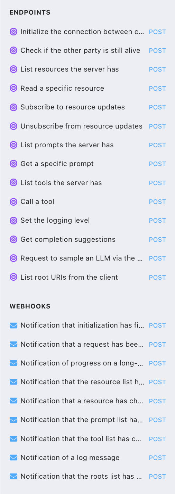

These are all the methods (taken from https://github.com/modelcontextprotocol/modelcontextprotocol/blob/main/schema/2025-03-26/schema.json) and turned into a OpenAPI spec using Claude.

This is just to understand the methods that make the MCP work. I don't know if there's any other use to this, except that I wished MCP was using REST rather than SSE/LSP.

Quite insightful!

See https://mcp-as-openapi.wilmake.com to check the schemas of each method.
